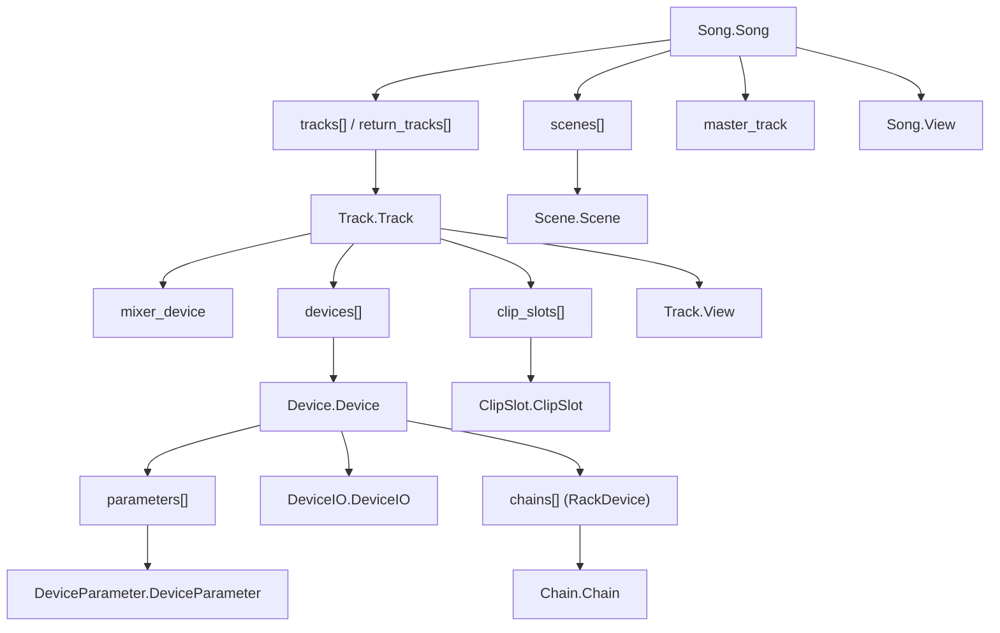

# Ableton Live Object Model reference (observed in Live 12.4.3)

> **Status: empirical, unsupported API reference.** This is a record of what
> `RecallExplorer` observed in Ableton Live 12.4.3, not an Ableton contract.
> Re-test every claim after a Live update and treat a missing member or failed
> getter as a normal compatibility outcome.

## Scope and evidence

| Field | Value |
|---|---|
| Live version | 12.4.3, build `2026-07-07_e3d8be4d07` |
| Observation date | 2026-08-14 |
| Explorer run | `lom-1786721631227` |
| Result | 699 unique objects; no scanner truncation or failure |
| Test Set | 14 tracks, 8 scenes, 88 clip slots, Reverb and Delay return devices |

The source is the read-only `RecallExplorer` Remote Script. It enumerates public
members, reads properties, records getter failures, and walks Live's vector
collections. It does **not** call methods, add listeners, write into the Set,
or send data through Recall's capture protocol.

This reference says an item is **observed** only when that scan exposed it. It
does not mean Recall currently stores or presents that data; see
[the tracking inventory](./ableton-tracking-inventory.md) for that distinction.

## Topology

The LOM is a graph rather than a strict tree. `canonical_parent` provides the
upward edge, and the same Track may be reachable from `tracks`,
`visible_tracks`, a clip slot, or its parent. Use the undocumented but stable in
this build `_live_ptr` value to deduplicate Live proxy wrappers; do not use the
Python `id()` alone.

## Runtime rules

- Collections are Live `Base.Vector`, `Base.StringVector`, or specialised
  `*Vector` types, not necessarily Python lists. They support iteration and
  reported a length in this build.
- A member can exist on an object's class yet raise for a particular subtype.
  Always wrap LOM property reads in `try`/`except`.
- Listener APIs consistently follow `add_<property>_listener`,
  `remove_<property>_listener`, and `<property>_has_listener`. They are omitted
  from the method lists below for readability, but were observed alongside the
  corresponding properties.
- Method presence is not permission to call it. Some methods mutate the Set,
  create clips/tracks, or establish listeners. The explorer intentionally only
  records their names.
- Raw parameter values are often normalized ranges such as `0..1`; use
  `display_value` or `str_for_value(value)` to render the unit-bearing value
  shown in Live.

## `Song.Song`

Root object for the current Set. One instance was observed.

### Readable properties

| Group | Members |
|---|---|
| Identity and hierarchy | `name`, `file_path`, `canonical_parent`, `view` |
| Collections | `tracks`, `visible_tracks`, `return_tracks`, `scenes`, `cue_points`, `groove_pool`, `master_track` |
| Transport | `is_playing`, `current_song_time`, `last_event_time`, `start_time`, `song_length`, `loop`, `loop_start`, `loop_length`, `back_to_arranger` |
| Recording | `record_mode`, `session_record`, `session_record_status`, `session_automation_record`, `arrangement_overdub`, `overdub`, `is_counting_in`, `count_in_duration`, `select_on_launch` |
| Time and feel | `tempo`, `signature_numerator`, `signature_denominator`, `swing_amount`, `groove_amount`, `clip_trigger_quantization`, `midi_recording_quantization` |
| Scale and tuning | `root_note`, `scale_name`, `scale_mode`, `scale_intervals`, `tuning_system` |
| Link and automation | `is_ableton_link_enabled`, `is_ableton_link_start_stop_sync_enabled`, `tempo_follower_enabled`, `re_enable_automation_enabled` |
| Capability/state flags | `appointed_device`, `can_capture_midi`, `can_jump_to_next_cue`, `can_jump_to_prev_cue`, `can_undo`, `can_redo`, `exclusive_arm`, `exclusive_solo`, `metronome`, `nudge_up`, `nudge_down`, `punch_in`, `punch_out` |

### Non-listener methods

`begin_undo_step`, `end_undo_step`, `undo`, `redo`, `create_audio_track`,
`create_midi_track`, `create_return_track`, `delete_track`,
`delete_return_track`, `create_scene`, `delete_scene`, `duplicate_track`,
`duplicate_scene`, `move_device`, `find_device_position`, `capture_midi`,
`capture_and_insert_scene`, `continue_playing`, `start_playing`, `stop_playing`,
`stop_all_clips`, `play_selection`, `jump_by`, `jump_to_next_cue`,
`jump_to_prev_cue`, `scrub_by`, `tap_tempo`, `trigger_session_record`,
`re_enable_automation`, `set_or_delete_cue`, `is_cue_point_selected`,
`get_current_beats_song_time`, `get_current_smpte_song_time`,
`get_beats_loop_start`, `get_beats_loop_length`, `force_link_beat_time`,
`sync_parameter_changes`, `get_data`, `set_data`.

## `Track.Track`

Fourteen Track objects were observed, including main, group, return, and normal
tracks. Treat the track kind as a precondition for several getters.

### Readable properties

| Group | Members |
|---|---|
| Identity and structure | `name`, `color`, `color_index`, `canonical_parent`, `group_track`, `is_grouped`, `is_foldable`, `fold_state`, `is_visible`, `is_part_of_selection`, `view` |
| Children | `devices`, `clip_slots`, `take_lanes`, `mixer_device` |
| I/O capability and routing | `has_audio_input`, `has_audio_output`, `has_midi_input`, `has_midi_output`, `current_input_routing`, `current_input_sub_routing`, `current_output_routing`, `current_output_sub_routing`, `input_routings`, `input_sub_routings`, `output_routings`, `output_sub_routings`, `input_routing_type`, `input_routing_channel`, `output_routing_type`, `output_routing_channel`, available input/output routing types and channels |
| Mix and record state | `arm`, `implicit_arm`, `mute`, `solo`, `muted_via_solo`, `can_be_armed`, `can_be_frozen`, `is_frozen`, `back_to_arranger`, `fired_slot_index`, `playing_slot_index` |
| Meters and performance | `input_meter_left`, `input_meter_right`, `input_meter_level`, `output_meter_left`, `output_meter_right`, `output_meter_level`, `performance_impact` |
| Arrangement state | `arrangement_clips`, `current_monitoring_state`, `can_show_chains`, `is_showing_chains` |

### Getter caveats observed

One or more Track types raised when reading `arm`, `implicit_arm`,
`arrangement_clips`, `current_monitoring_state`, `fired_slot_index`,
`playing_slot_index`, `fold_state`, `mute`, `solo`, `muted_via_solo`, and the
left/right meter members. The log specifically reports that main, group, and
return tracks have no arrangement clips, while main and return tracks have no
arm or monitoring state. Do not treat a getter error as a missing Track.

### Non-listener methods

`create_audio_clip`, `create_midi_clip`, `create_take_lane`, `delete_clip`,
`delete_device`, `duplicate_clip_slot`, `duplicate_clip_to_arrangement`,
`duplicate_device`, `insert_device`, `jump_in_running_session_clip`,
`monitoring_states`, `stop_all_clips`, `get_data`, `set_data`.

## `MixerDevice.MixerDevice`

Each Track exposes a mixer device. Fourteen mixer devices were observed.

| Group | Members |
|---|---|
| Common channel controls | `volume`, `panning`, `panning_mode`, `track_activator`, `sends`, `canonical_parent` |
| Master-specific controls | `crossfader`, `crossfade_assign`, `cue_volume`, `left_split_stereo`, `right_split_stereo`, `song_tempo` |

`crossfade_assign`, `crossfader`, `cue_volume`, and `song_tempo` raised on one
or more non-master mixer devices. Guard these reads by object role or exception
handling. The observed methods are `crossfade_assignments()` and
`panning_modes()`.

## `Device.Device`

Two devices were present in the test Set: `Reverb` and `Delay`.

| Group | Members |
|---|---|
| Identity | `name`, `class_name`, `class_display_name`, `type`, `canonical_parent` |
| Structure | `parameters`, `can_have_chains`, `can_have_drum_pads`, `view` |
| State | `is_active`, `can_compare_ab`, `is_using_compare_preset_b`, `latency_in_ms`, `latency_in_samples` |

Observed non-listener methods: `save_preset_to_compare_ab_slot()` and
`store_chosen_bank()`.

## `DeviceParameter.DeviceParameter`

The scan found 159 parameter objects: 60 from the two devices and 99 from mixer
devices. This is the most important object for parameter mapping and automation.

| Group | Members |
|---|---|
| Identity | `name`, `original_name`, `canonical_parent` |
| Value contract | `value`, `display_value`, `min`, `max`, `default_value`, `is_quantized`, `is_enabled` |
| Discrete choices | `value_items`, `short_value_items` |
| Automation and state | `automation_state`, `state` |

`default_value`, `display_value`, `value_items`, and `short_value_items` raised
for at least one parameter in this Set. They are conditional capabilities, not
universal fields. The observed non-listener methods are `begin_gesture()`,
`end_gesture()`, `re_enable_automation()`, and `str_for_value(value)`.

The versioned Reverb and Delay parameter tables are maintained in
[the tracking inventory](./ableton-tracking-inventory.md#device-parameter-inventory-current-test-set).

## `Scene.Scene`

| Group | Members |
|---|---|
| Identity and slots | `name`, `color`, `color_index`, `canonical_parent`, `clip_slots` |
| State | `is_empty`, `is_triggered` |
| Scene overrides | `tempo`, `tempo_enabled`, `time_signature_numerator`, `time_signature_denominator`, `time_signature_enabled` |

Observed non-listener methods: `fire()`, `fire_as_selected()`, and
`set_fire_button_state()`.

## `ClipSlot.ClipSlot`

| Group | Members |
|---|---|
| Identity and clip | `canonical_parent`, `clip`, `has_clip`, `color`, `color_index` |
| Launch and recording state | `is_playing`, `is_recording`, `is_triggered`, `playing_status`, `will_record_on_start`, `has_stop_button`, `controls_other_clips`, `is_group_slot` |

Observed non-listener methods: `create_audio_clip()`, `create_clip()`,
`delete_clip()`, `duplicate_clip_to()`, `fire()`, `set_fire_button_state()`,
and `stop()`.

## Large-project observations (partial scan)

The reference Set above establishes the baseline API surface. A second,
substantially larger project was scanned on the same Live build and exposed the
additional object types below.

| Field | Value |
|---|---|
| Explorer run | `lom-1786724566204` |
| Result | completed without a script failure |
| Objects recorded | 2,500 (global limit reached) |
| Device parameters reached | 1,921 |
| Omitted objects | 1,964 after the global object cap |
| Omitted collection entries | 1,147 after the per-collection cap |
| Representative caps | 6,051 routing types, 658 routing channels, 1,722 clips, and 752 clip slots omitted after their per-type caps |

This is valid evidence that the members below exist in Live 12.4.3. It is **not**
evidence that the listed object counts are the project's totals, or that an
unobserved member does not exist. This scan uses the priority traversal: it
reaches tracks, devices, mixer devices, and parameters before low-signal routing
and clip collections. Its class/member observations are therefore substantially
stronger than the preceding run, even though it is still not a complete instance
inventory of the Set.

| Newly observed type | Recorded instances | Notes |
|---|---:|---|
| `PluginDevice.PluginDevice` | 23 | Third-party plug-in wrapper |
| `RackDevice.RackDevice` | 9 | Rack macros, chains, and variations |
| `MaxDevice.MaxDevice` | 6 | Max for Live device wrapper |
| `Eq8Device.Eq8Device` | 26 | Built-in EQ Eight device |
| `Chain.Chain` | 14 | Rack-chain wrapper |
| `DeviceIO.DeviceIO` | 14 | Device routing I/O wrapper |
| `Clip.Clip` | 32 | Clip content/warp/note API; representative cap reached |
| `Track.RoutingType` | 32 | Named routing choice objects; representative cap reached |
| `Track.RoutingChannel` | 32 | Routing-channel objects; representative cap reached |

The observed device `class_name` values in this project are
`AudioEffectGroupDevice`, `AutoPan`, `AutoShift`, `Delay`, `Eq8`, `Erosion`,
`GlueCompressor`, `InstrumentGroupDevice`, `MxDeviceAudioEffect`,
`PluginDevice`, `Reverb`, `Saturator`, `SpectrumAnalyzer`, and `StereoGain`.

### `PluginDevice.PluginDevice`

This shares the general `Device.Device` surface and adds plug-in-specific state.

| Group | Members |
|---|---|
| General device state | `name`, `class_name`, `class_display_name`, `type`, `canonical_parent`, `parameters`, `view`, `is_active`, `latency_in_ms`, `latency_in_samples` |
| Plug-in state | `is_editor_open`, `presets`, `selected_preset_index` |
| Capability/compare flags | `can_compare_ab`, `can_have_chains`, `can_have_drum_pads` |

`is_using_compare_preset_b` raised on one or more PluginDevice instances.
Observed non-listener methods: `get_parameter_names()`,
`save_preset_to_compare_ab_slot()`, `store_chosen_bank()`, and `View()`.

### `RackDevice.RackDevice`

| Group | Members |
|---|---|
| General device state | `name`, `class_name`, `class_display_name`, `type`, `canonical_parent`, `parameters`, `view`, `is_active`, `latency_in_ms`, `latency_in_samples` |
| Rack structure | `chains`, `return_chains`, `can_show_chains`, `is_showing_chains` |
| Macro and variation state | `chain_selector`, `has_macro_mappings`, `macros_mapped`, `visible_macro_count`, `selected_variation_index`, `variation_count` |
| Capability/compare flags | `can_compare_ab`, `can_have_chains`, `can_have_drum_pads` |

`drum_pads`, `has_drum_pads`, `visible_drum_pads`, and
`is_using_compare_preset_b` raised on one or more RackDevice instances.
Observed non-listener methods: `insert_chain()`, `copy_pad()`,
`randomize_macros()`, `store_variation()`, `delete_selected_variation()`,
`recall_selected_variation()`, `recall_last_used_variation()`,
`save_preset_to_compare_ab_slot()`, `store_chosen_bank()`, and `View()`.

### `MaxDevice.MaxDevice`

| Group | Members |
|---|---|
| General device state | `name`, `class_name`, `class_display_name`, `type`, `canonical_parent`, `parameters`, `view`, `is_active`, `latency_in_ms`, `latency_in_samples` |
| Max I/O | `audio_inputs`, `audio_outputs`, `midi_inputs`, `midi_outputs` |
| Capability/compare flags | `can_compare_ab`, `can_have_chains`, `can_have_drum_pads` |

`is_using_compare_preset_b` raised on one or more MaxDevice instances.
Observed non-listener methods: `get_bank_count()`, `get_bank_name()`,
`get_bank_parameters()`, `get_value_item_icons()`,
`save_preset_to_compare_ab_slot()`, `store_chosen_bank()`, and `View()`.

### `Eq8Device.Eq8Device`

EQ Eight shares the general `Device.Device` surface and adds `edit_mode`,
`global_mode`, and `oversample`. The scan observed no failing getter on its
26 instances. Its non-listener methods were `save_preset_to_compare_ab_slot()`,
`store_chosen_bank()`, and `View()`.

### `Chain.Chain`

Rack chains expose their own identity, I/O capability, device collection, and
mixer device:

| Group | Members |
|---|---|
| Identity and appearance | `name`, `color`, `color_index`, `is_auto_colored`, `canonical_parent` |
| Children and mixer | `devices`, `mixer_device` |
| I/O capability | `has_audio_input`, `has_audio_output`, `has_midi_input`, `has_midi_output` |
| Mix state | `mute`, `solo`, `muted_via_solo` |

Observed non-listener methods: `insert_device()`, `delete_device()`, and
`duplicate_device()`.

### `DeviceIO.DeviceIO`

This object describes a device's routing choices, distinct from Track routing.

| Group | Members |
|---|---|
| Identity | `canonical_parent` |
| Available choices | `available_routing_types`, `available_routing_channels` |
| Current/default choice | `routing_type`, `routing_channel`, `default_external_routing_channel_is_none` |

No non-listener methods or getter failures were observed on the 14 instances.

### Device view objects

The scan reached view-state wrappers as separate objects:

| Type | Readable members | Getter caveats |
|---|---|---|
| `Device.View` | `canonical_parent`, `is_collapsed` | none observed |
| `Eq8Device.View` | `canonical_parent`, `is_collapsed`, `selected_band` | none observed |
| `RackDevice.View` | `canonical_parent`, `is_collapsed`, `is_showing_chain_devices`, `selected_chain` | `drum_pads_scroll_position` and `selected_drum_pad` raised on one or more instances |

### `Clip.Clip`

`Clip.Clip` is distinct from the slot that owns it. Its readable surface divides
into clip identity/state, MIDI-note editing, and audio/warp capabilities:

| Group | Members |
|---|---|
| Identity and placement | `name`, `color`, `color_index`, `canonical_parent`, `position`, `start_time`, `end_time`, `length`, `signature_numerator`, `signature_denominator`, `view` |
| Clip and launch state | `is_midi_clip`, `is_audio_clip`, `is_session_clip`, `is_arrangement_clip`, `is_take_lane_clip`, `is_playing`, `is_recording`, `is_overdubbing`, `is_triggered`, `will_record_on_start`, `playing_position`, `launch_mode`, `launch_quantization`, `legato`, `muted` |
| Loop and groove | `looping`, `loop_start`, `loop_end`, `groove`, `has_groove`, `has_envelopes`, `automation_envelopes` |
| Audio/sample and warp | `file_path`, `gain`, `gain_display_string`, `pitch_coarse`, `pitch_fine`, `ram_mode`, `sample_length`, `sample_rate`, `warping`, `warp_mode`, `available_warp_modes`, `warp_markers`, `start_marker`, `end_marker` |
| MIDI performance | `velocity_amount` |

Audio/sample and warp getters are conditional: `available_warp_modes`,
`file_path`, `gain`, `gain_display_string`, `pitch_coarse`, `pitch_fine`,
`ram_mode`, `sample_length`, `sample_rate`, `warp_markers`, `warp_mode`, and
`warping` raised on one or more clips. Guard them by clip type and exceptions.

Observed non-listener methods include `get_notes()`, `get_notes_extended()`,
`get_all_notes_extended()`, `get_notes_by_id()`, `get_selected_notes()`,
`set_notes()`, `apply_note_modifications()`, `replace_selected_notes()`,
`duplicate_notes_by_id()`, `select_all_notes()`, `select_notes_by_id()`,
`deselect_all_notes()`, `quantize()`, `quantize_pitch()`, `duplicate_loop()`,
`duplicate_region()`, `crop()`, `automation_envelope()`,
`create_automation_envelope()`, `clear_envelope()`, `clear_all_envelopes()`,
`beat_to_sample_time()`, `sample_to_beat_time()`, `seconds_to_sample_time()`,
`move_warp_marker()`, `move_playing_pos()`, `note_number_to_name()`, `fire()`,
`stop()`, `scrub()`, `stop_scrub()`, and `set_fire_button_state()`.

### Routing objects

`Track.RoutingType` exposes `attached_object`, `category`, and `display_name`.
`Track.RoutingChannel` exposes `display_name` and `layout`. No non-listener
methods or failed getters were observed for either wrapper in this scan.

## Adding evidence

Run every new experiment against a dedicated Set, then append a dated entry
that includes the Live build, object path, property or method, input state,
observed output, exceptions, and whether it was read-only or mutating. Do not
merge results from different Live builds without recording the version boundary.

For a new device, preserve its LOM base path and parameter index as well as its
parameter name: names can change with device language/localization or a future
Live build, while the index is useful for comparison and regression testing.
