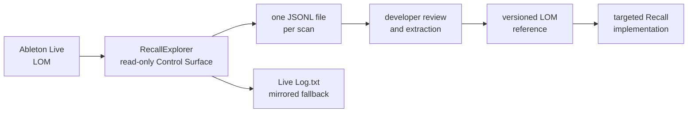

# RecallExplorer developer guide

This guide is for developers who need to inspect Ableton Live's undocumented
Live Object Model (LOM), extend the `RecallExplorer` Remote Script safely, or
turn a scan into an implementation decision for Recall.

`RecallExplorer` is a research tool. It is separate from Recall's capture
surface: it opens no socket, emits no Recall events, adds no listeners, and
never invokes an exposed LOM method.

## What to read first

| Document | Purpose |
|---|---|
| [Live 12.4.3 LOM reference](./ableton-lom-reference-live-12.4.3.md) | Empirical object/member catalogue and versioned scan evidence |
| [Tracking inventory](./ableton-tracking-inventory.md) | Distinguishes LOM observation from data Recall actually captures |
| [Capture evidence contract](./capture-evidence.md) | What Recall is allowed to claim in the product UI |
| [Explorer source](../remote-script/RecallExplorer/__init__.py) | The scan implementation and safety limits |
| [Explorer tests](../remote-script/tests/test_lom_explorer.py) | Pure behavior tests runnable outside Ableton |

## Architecture



The current traversal starts at `self.song`, reads public members, walks child
objects and Live vectors, detects cycles, and produces a graph. It intentionally
does not try to use every discovered method; methods may change a Set, make a
large read, or register a listener.

## Deploy and run

1. Close Ableton Live.
2. From the repository root, deploy the standalone control surface:

   ```powershell
   npm run deploy:lom-explorer
   ```

3. Start Live, open the target Set, then choose **RecallExplorer** in an unused
   **Control Surface** slot under **Settings/Preferences → Link, Tempo & MIDI**.
   Leave its Input and Output as `None`.
4. Wait for `run_completed`. A large Set can take several minutes because the
   scanner intentionally runs only a few objects per Live display update.
5. Set the surface back to `None` when the scan has finished.

Live only loads changed Remote Scripts on startup. Deploying while Live is open
does not update the in-memory script.

## Finding the output

Every scan creates its own newline-delimited JSON (`.jsonl`) file:

```text
%APPDATA%\com.gberg.recall-studio\lom-explorer\scan-lom-<run-id>.jsonl
```

For the current Windows user, that expands to:

```text
C:\Users\gberg\AppData\Roaming\com.gberg.recall-studio\lom-explorer\
```

Do not delete Ableton's `Log.txt`; it remains useful for Live diagnostics. The
Explorer mirrors records there as a fallback, but the dedicated JSONL file is
the source to analyze because it contains one run and no unrelated Live output.

The first `run_started` record includes the full `output_file` path. All
following records sharing its `run_id` belong to that same scan.

## JSONL record format

Each physical line is one JSON object. There are four useful record kinds:

| `record` | Meaning |
|---|---|
| `run_started` | Scan identity, output path, and active safety limits |
| `node` | One LOM object, its path, type, and member observations |
| `run_completed` | Final object count and all truncations |
| `run_failed` / `run_interrupted` | The scan did not finish; treat its object list as partial |

A node has the following shape:

```json
{
  "record": "node",
  "node": "node-00042",
  "path": "song.tracks[3].devices[0].parameters[5]",
  "type": "DeviceParameter.DeviceParameter",
  "depth": 4,
  "attributes": [
    {"name": "name", "value": {"kind": "value", "value": "Dry/Wet"}},
    {"name": "value", "value": {"kind": "value", "value": 0.5}},
    {"name": "str_for_value", "kind": "method"}
  ],
  "run_id": "lom-…",
  "script_version": "0.1.0"
}
```

Value descriptors distinguish scalars, collections, child objects, and repeated
references. A `reference` points to an object already emitted; that is normal in
the LOM graph and prevents loops through `canonical_parent`.

## Fast local inspection

The following PowerShell snippet lists the most common object types in the most
recent scan without touching Ableton's shared log:

```powershell
$file = Get-ChildItem "$env:APPDATA\com.gberg.recall-studio\lom-explorer" `
  -Filter 'scan-*.jsonl' | Sort-Object LastWriteTime -Descending | Select-Object -First 1

Get-Content $file.FullName |
  ForEach-Object { $_ | ConvertFrom-Json } |
  Where-Object { $_.record -eq 'node' } |
  Group-Object type |
  Sort-Object Count -Descending |
  Select-Object Count, Name
```

To focus on parameter nodes, add:

```powershell
Where-Object { $_.type -eq 'DeviceParameter.DeviceParameter' }
```

## Reading the LOM correctly

### Collection types are not always Python lists

Live uses `Base.Vector`, `Base.StringVector`, and specialised `*Vector` wrapper
types for child collections. The explorer recognizes and iterates these types.
Production code should not assume `isinstance(value, list)` before traversing a
LOM collection.

### Python identity is not Live identity

The same Live object can be returned as several Python proxy wrappers. Deduplicate
through `object._live_ptr` where it is available; do not use Python's `id()` as
the only identity. Recall uses this same identity strategy for snapshots.

### A discovered property can still fail

Many members are defined on a broad class but are invalid for a particular
object role. Examples from Live 12.4.3:

- a main or return Track can reject `arm` or `current_monitoring_state`;
- audio-only Clip properties can reject reads on MIDI clips;
- master-only mixer members can reject reads on normal tracks;
- parameter item/default/display fields can be absent for some controls.

Always wrap LOM property reads individually. A failed getter is evidence of a
state or subtype boundary, not a reason to abandon the whole scan.

### Public does not mean safe to call

Methods such as `create_audio_track`, `set_notes`, `insert_device`, or listener
registration calls can mutate the Set or change Live's runtime state. Explorer
records method names only. Before invoking one in Recall, write a targeted
fixture, test on a disposable Set, and document its behavior by Live version.

## Interpreting limits

Explorer is deliberately bounded because it runs inside Live's main process.

| Limit | Default | Why it exists |
|---|---:|---|
| `MAX_DEPTH` | 6 | Stops recursive parent/child graph expansion |
| `MAX_OBJECTS` | 2,500 | Bounds work and log size for a full Set scan |
| `MAX_ATTRIBUTES_PER_OBJECT` | 256 | Bounds per-object getter work |
| `MAX_COLLECTION_ITEMS` | 128 | Bounds wide collections |
| `MAX_NODES_PER_TYPE` | targeted caps | Prevents routing and clips from starving device/parameter discovery |
| `NODES_PER_UPDATE` | 2 | Prevents one display tick from monopolizing Live |

`run_completed.truncations` is part of the result, not noise:

- `max_objects` means the global object budget ran out.
- `collection_items` means a single collection was wider than its cap.
- `type_limit:<type>` means a repetitive low-signal class reached its sample cap.

For API documentation, a truncated scan can still establish an object's members.
It cannot prove instance totals or prove a missing member does not exist.

Do not raise every limit indiscriminately. First ask which API surface is
missing. Use a small dedicated fixture Set to test a device class, or add a
temporary targeted priority/cap only for the relevant object type. Increase
`MAX_OBJECTS` for a one-off exhaustive run only when Live remains responsive and
the resulting log size is acceptable.

## Extending the explorer

### When a valuable relation is starved

Add its member name to `PRIORITY_RELATIONSHIPS` in
`remote-script/RecallExplorer/__init__.py`. High-priority children are scanned
before ordinary routing and clip collections. Suitable examples are structural
paths such as `devices`, `parameters`, `chains`, and `mixer_device`.

Do not prioritize broad, low-signal members such as available routing choices or
every clip slot unless that is the explicit experiment; they can consume the
whole object budget.

### When one type is excessively repetitive

Add an explicit cap to `MAX_NODES_PER_TYPE`. Current caps cover routing wrappers,
clips, and clip slots. Do not cap `DeviceParameter.DeviceParameter` by default:
its parent/device/name combinations are the main output needed for Recall.

Every cap must remain visible in `run_started` and in final truncation data. A
silent omission makes empirical documentation unreliable.

### When you need a method's output

Do not make the recursive explorer call it globally. Instead, create a dedicated
read-only probe with:

1. a narrow object/path predicate;
2. a small, known fixture Set;
3. a method allow-list;
4. `try`/`except` around each invocation;
5. output that records the Live version, input, result, and error;
6. a cleanup path when the probe registers anything.

This keeps mutation and expensive reads out of the general scan.

## Turning a scan into Recall work

Use the scan as compatibility evidence, then decide whether the observation is
worth production capture:

1. Add the type/member/result to the versioned LOM reference.
2. Decide whether it represents a durable producer decision or merely transient
   Live state.
3. If it is valuable, add a narrow listener/snapshot path in
   `remote-script/Recall/__init__.py`.
4. Update the protocol, storage/projection code, and
   [capture evidence contract](./capture-evidence.md) together.
5. Add a regression test and a real Live fixture before showing it in the UI.

The current scans validate the general structure Recall needs:

```text
Song → Track → MixerDevice / Device → DeviceParameter
                         └→ RackDevice → Chain → Device → DeviceParameter
```

Plug-ins and Max devices still use the generic `parameters` collection, so the
first production path should remain generic. Add device-specific handling only
when a versioned test proves it exposes useful extra state.

## Testing changes outside Live

The test module installs a minimal Ableton import stub so pure walker behavior
can run under a normal Python interpreter. If `pytest` is installed:

```powershell
python -m pytest remote-script\tests -q
```

The important regression cases cover vector traversal, cycles, Live proxy
deduplication, priority ordering, repetitive-type caps, and dedicated JSONL
paths. Anything that requires a real LOM object must still be tested manually in
Live on a disposable Set.

## Before merging a new observation

- Record the exact Live build and scan `run_id`.
- Mark partial scans and truncations explicitly.
- Preserve raw parameter index **and** parameter name.
- Distinguish an observed capability from a Recall-captured field.
- Never claim exact automation geometry from a live listener scan.
- Keep the Explorer isolated from Recall's TCP protocol and capture listeners.
- Preserve old JSONL files; they are evidence for future version comparisons.
